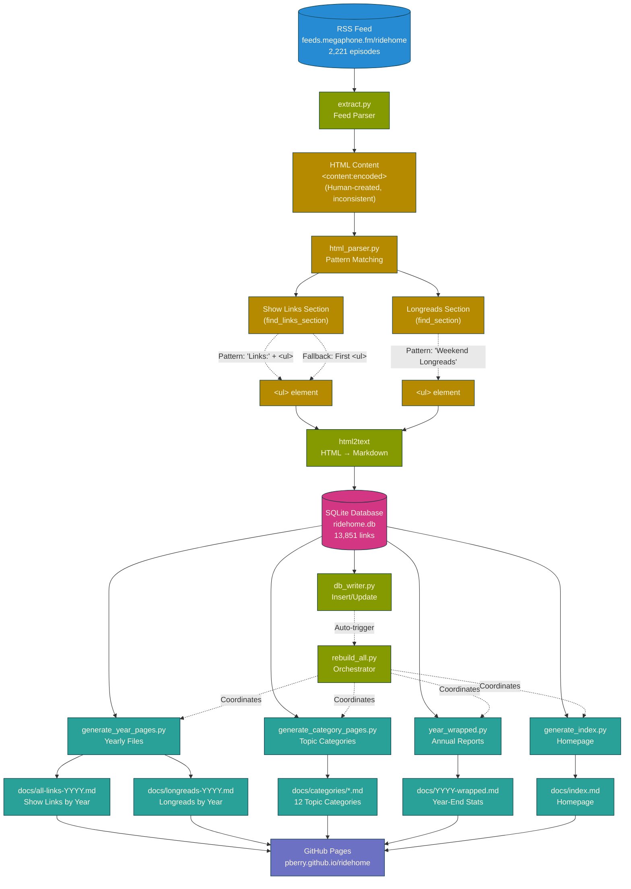

# ridehome

RSS feed parser for [The Ride Home](https://www.ridehome.info/podcast/techmeme-ride-home/) podcast.

Extracts daily show links and Friday longreads from the podcast RSS feed, generating static markdown pages and providing analytics capabilities.

**Live site**: [pberry.github.io/ridehome](https://pberry.github.io/ridehome/)

---

## Features

- **RSS Parsing**: Extracts links from podcast feed HTML content
- **Dual Content Types**: Show links (daily) + Weekend longreads (Fridays)
- **Robust HTML Parsing**: Handles 2,221+ episodes with inconsistent formatting
- **Analytics Database**: SQLite schema with 12,700+ links
- **Static Site Generation**: Markdown output for GitHub Pages
- **Year Wrapped Reports**: Spotify-style yearly summaries
- **Historical Archive**: Complete data from April 2018 to present

---

## Quick Start

```bash
# Install dependencies
python3 -m venv env
source env/bin/activate
pip install -r requirements.txt

# Extract links from RSS feed
./extract.py --type all

# Rebuild all generated markdown files from database
python3 rebuild_all.py

# Generate year wrapped report
./year_wrapped.py 2025

# View output
ls docs/
```

---

## Project Structure

**Core Components** (platform-agnostic):
```
extract.py              # RSS parser and link extractor
html_parser.py          # HTML parsing logic
db_schema.py            # SQLite schema
db_writer.py            # Database writer
file_updater.py         # Markdown file updater
year_wrapped.py         # Yearly summary generator
load_db.py              # Import markdown files to database
export_yearly_files.py  # Export database to yearly markdown
```

**Content**:
```
docs/                   # GitHub Pages site output
  all-links-YYYY.md     # Show links by year (2018-2025)
  longreads-YYYY.md     # Friday longreads (2022-2025)
  YYYY-wrapped.md       # Yearly summary reports
```

**Tests**:
```
test_html_parser.py     # HTML parsing tests
test_markdown_parser.py # Markdown parsing tests
```

---

## Testing

```bash
# Run all tests
python3 -m unittest discover -p "test_*.py"
```

Tests are based on real RSS feed edge cases and parsing bugs discovered over 7+ years.

---

## Architecture Diagram



**Key Architecture Points:**

1. **Database-First Design (v2.0.0)**: SQLite is the single source of truth; all markdown files are generated artifacts
2. **HTML Parsing Complexity**: Human-created RSS content is highly inconsistent (45% standard, 26% no links, 5% no headers)
3. **Pattern Matching**: Two-step structural check (find paragraphs → filter by `<ul>` next sibling → choose shortest)
4. **Automatic Regeneration**: `rebuild_all.py` orchestrates all generators after database updates
5. **Incremental Updates**: Hash-based change detection only writes files when content differs

---

## Documentation

- **[CLAUDE.md](./CLAUDE.md)** - Project context and architecture
- **[CHANGELOG.md](./CHANGELOG.md)** - Version history

---

## Data

**Current Stats** (as of Dec 2025):
- **12,707 links** extracted (12,058 showlinks + 649 longreads)
- **1,800+ episodes** parsed (April 2018 - Dec 2025)
- **600+ unique sources** identified
- **7.7 years** of data

**Date Range**: April 16, 2018 → December 19, 2025

---

## Contributing

This is a personal learning project, but contributions are welcome!

**Areas for contribution**:
- Parser improvements for edge cases
- Enhanced analytics queries
- UI improvements for GitHub Pages site
- Additional deployment options

---

## License

MIT (see LICENSE file)
