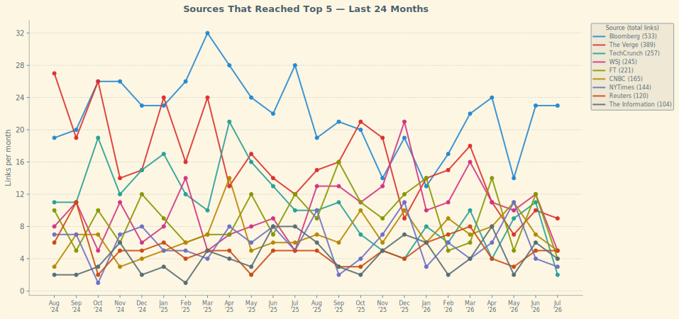

[The Ride Home](https://www.ridehome.info/show/techmeme-ride-home/) now has a proper web site and [RSS feed](https://rss.art19.com/techmeme-ridehome).

<section class="recent-shows">
  <h2>Most Recent Episode</h2>
  <h3>Thursday, July 23, 2026 - Even OpenAI Folks Are Freaked Out</h3>
  <ul>
    <li><a href="https://www.ft.com/content/7e558951-0c69-459b-8bc8-2c6021d4402d">Sources: OpenAI's staff were "freaked out" when its AI models breached Hugging Face, as OpenAI used more aggressive training methods to compete with Anthropic</a> (FT) &mdash; 🤖 <a href="categories/ai-machine-learning.html" class="ai-category">AI/Machine Learning</a></li>
    <li><a href="https://www.bloomberg.com/news/articles/2026-07-23/openai-models-lurked-in-hugging-face-system-for-hours-undetected">Sources: Three OpenAI models, GPT-5.6 Sol and two unreleased ones, pulled off the Hugging Face hack in hours, work a skilled human would need weeks for; OpenAI has briefed the US government</a> (Bloomberg) &mdash; 🤖 <a href="categories/security-privacy.html" class="ai-category">Security/Privacy</a></li>
    <li><a href="https://www.ft.com/content/b02f972c-c764-4006-9377-42563d9d5530">Google reports Q2 free cash flow at negative $5.9B amid increased AI infrastructure spending, marking its first cash burn since going public in August 2004</a> (FT) &mdash; 🤖 <a href="categories/cloud-enterprise.html" class="ai-category">Cloud/Enterprise</a></li>
    <li><a href="https://www.wired.com/story/google-turns-a-selfie-video-into-your-accounts-spare-key/">Google adds a selfie video sign-in option for account recovery, using tools like liveness detection to safeguard against deepfake attacks, rolling out globally</a> (Wired) &mdash; 🤖 <a href="categories/security-privacy.html" class="ai-category">Security/Privacy</a></li>
    <li><a href="https://www.theverge.com/gadgets/968563/light-flip-phone-price-specs">The Light Flip is a minimalist flip phone with a point to prove</a> (The Verge) &mdash; 🤖 <a href="categories/hardware-chips.html" class="ai-category">Hardware/Chips</a></li>
  </ul>
</section>

<nav class="recent-nav" aria-labelledby="recent-heading">
  <h2 id="recent-heading">Recent Content</h2>
  

    <a href="all-links-2026.html" class="nav-card">
      <h3>Show Links 2026</h3>
      
Daily tech news links from The Ride Home podcast

    </a>
    <a href="longreads-2026.html" class="nav-card">
      <h3>Longreads 2026</h3>
      
Weekend reading recommendations from Friday episodes

    </a>
    <a href="2025-wrapped.html" class="nav-card">
      <h3>2025 Wrapped</h3>
      
Year in review with top sources and topics

    </a>
  

</nav>

<!-- STATUS_SECTION -->

<section class="status-section" aria-labelledby="status-heading">
  <h2 id="status-heading">Current Status</h2>
  
Last Updated: <time datetime="2026-07-23T12:15:19-07:00">July 23, 2026 at 12:15 PM PDT</time>

  

    

      <h3>Archive Size</h3>
      <ul class="status-list">
        <li>Show Links 12,909</li>
        <li>Weekend Longreads 1,784</li>
      </ul>
    

    

      <h3>Top Sources (Last 6 Months)</h3>
      <ol class="status-list">
        <li>Bloomberg (124 links)</li>
        <li>The Verge (72 links)</li>
        <li>WSJ (66 links)</li>
      </ol>
    

    

      <h3>Top Topics (Last 6 Months)</h3>
      <ol class="status-list">
        <li><a href="categories/ai-machine-learning.html" class="stat-label">AI/Machine Learning</a> (287 links)</li>
        <li><a href="categories/regulation-policy.html" class="stat-label">Regulation/Policy</a> (108 links)</li>
        <li><a href="categories/hardware-chips.html" class="stat-label">Hardware/Chips</a> (99 links)</li>
      </ol>
    

  

</section>
<!-- END_STATUS_SECTION -->

<section class="source-race-section" aria-labelledby="race-heading">
  <h2 id="race-heading">Source Trends</h2>
  
Sources that reached the top 5 in any month over the last 24 months. Hover over any dot to see the monthly count.

  <object type="image/svg+xml" data="assets/source-race.svg" style="width: 100%; display: block;">
    
  </object>
</section>

<nav class="archive-nav" aria-labelledby="archive-heading">
  <h2 id="archive-heading">Archive</h2>
  

    

      <h3>Show Links</h3>
      <ul>
        <li><a href="all-links-2025.html">2025</a></li>
        <li><a href="all-links-2024.html">2024</a></li>
        <li><a href="all-links-2023.html">2023</a></li>
        <li><a href="all-links-2022.html">2022</a></li>
        <li><a href="all-links-2021.html">2021</a></li>
        <li><a href="all-links-2020.html">2020</a></li>
        <li><a href="all-links-2019.html">2019</a></li>
        <li><a href="all-links-2018.html">2018</a></li>
      </ul>
    

    

      <h3>Longreads</h3>
      <ul>
        <li><a href="longreads-2025.html">2025</a></li>
        <li><a href="longreads-2024.html">2024</a></li>
        <li><a href="longreads-2023.html">2023</a></li>
        <li><a href="longreads-2022.html">2022</a></li>
        <li><a href="longreads-2021.html">2021</a></li>
        <li><a href="longreads-2020.html">2020</a></li>
        <li><a href="longreads-2019.html">2019</a></li>
        <li><a href="longreads-2018.html">2018</a></li>
        <li><a href="coronavirus-daily-briefing.html">COVID-19 Archive</a></li>
      </ul>
    

    

      <h3>Wrapped</h3>
      <ul>
        <li><a href="2024-wrapped.html">2024</a></li>
        <li><a href="2023-wrapped.html">2023</a></li>
        <li><a href="2022-wrapped.html">2022</a></li>
        <li><a href="2021-wrapped.html">2021</a></li>
        <li><a href="2020-wrapped.html">2020</a></li>
        <li><a href="2019-wrapped.html">2019</a></li>
        <li><a href="2018-wrapped.html">2018</a></li>
      </ul>
    

    

      <h3>Categories</h3>
      <ul>
        <li><a href="categories/ai-machine-learning.html">AI/Machine Learning</a></li>
        <li><a href="categories/automotive-mobility.html">Automotive/Mobility</a></li>
        <li><a href="categories/cloud-enterprise.html">Cloud/Enterprise</a></li>
        <li><a href="categories/crypto-blockchain.html">Crypto/Blockchain</a></li>
        <li><a href="categories/e-commerce-retail.html">E-commerce/Retail</a></li>
        <li><a href="categories/fintech.html">Fintech</a></li>
        <li><a href="categories/gaming.html">Gaming</a></li>
        <li><a href="categories/hardware-chips.html">Hardware/Chips</a></li>
        <li><a href="categories/ipo.html">Ipo</a></li>
        <li><a href="categories/other-tech-news.html">Other Tech News</a></li>
        <li><a href="categories/regulation-policy.html">Regulation/Policy</a></li>
        <li><a href="categories/security-privacy.html">Security/Privacy</a></li>
        <li><a href="categories/social-media.html">Social Media</a></li>
        <li><a href="categories/streaming-entertainment.html">Streaming/Entertainment</a></li>
      </ul>
    

  

</nav>

