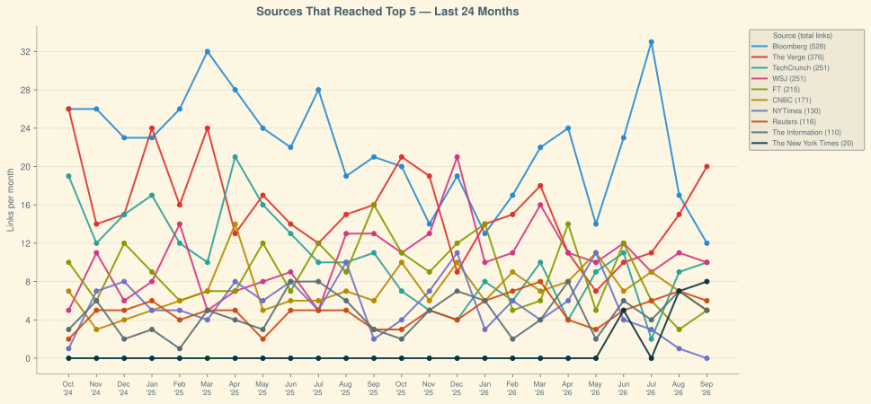

[The Ride Home](https://www.ridehome.info/show/techmeme-ride-home/) now has a proper web site and [RSS feed](https://rss.art19.com/techmeme-ridehome).

<section class="recent-shows">
  <h2>Most Recent Episode</h2>
  <h3>Tuesday, September 29, 2026 - We Have The Anthropic IPO Numbers</h3>
  <ul>
    <li><a href="https://www.reuters.com/business/finance/anthropics-ipo-prospectus-shows-sweeping-ai-vision-surging-costs-2026-09-28/">IPO prospectus: Anthropic reports a net loss of $42B in 2025, with operating losses of $8B+; revenue grew 12x to ~$4.6B, ~25% of which came from two customers</a> (Reuters) &mdash; 🤖 <a href="categories/ipo.html" class="ai-category">IPO</a></li>
    <li><a href="https://www.ft.com/content/c7685a7e-7745-4cbc-8053-4958d0ea449b?accessToken=zwAAAaDr2OW6kdPHaFp-d0VMvNOAU0lY0OpEmw.MEUCIQDri8jri2FtGIfJjPkxOZ5_1_ZIU_6mV2XSWAkmAyHGCQIgNTptc_pqS1KKFIP7hi0m8Qv5D4KIbxvhaHO4CGCedXQ&segmentId=e95a9ae7-622c-6235-5f87-51e412b47e97&shareId=21e300e9-e2ac-440e-a832-3462c6e1ca1b&shareType=enterprise&syn-25a6b1a6=1">Anthropic formally warns investors its technology may pose "existential risks to humanity," devoting almost a third of its S-1 to risk factors including AI manipulation and blackmail</a> (FT) &mdash; 🤖 <a href="categories/ipo.html" class="ai-category">IPO</a></li>
    <li><a href="https://www.reuters.com/legal/transactional/anthropic-leaders-control-ai-lab-via-founder-llc-promote-public-good-over-market-2026-09-29/">Anthropic's IPO filing creates a "Founder LLC" of its seven co-founders, whose majority vote directs a single Class F share with 50.1% of voting power, while the company stays a PBC</a> (Reuters) &mdash; 🤖 <a href="categories/ipo.html" class="ai-category">IPO</a></li>
    <li><a href="https://www.wsj.com/tech/ai/openai-chatgpt-model-release-cancel-safety-5a2f9f42?st=u6jQPM">OpenAI scraps plans to publicly launch GPT-6.1 Astra, saying it didn't quite meet its safety bar during internal testing, after targeting an October release</a> (WSJ) &mdash; 🤖 <a href="categories/ai-machine-learning.html" class="ai-category">AI/Machine Learning</a></li>
    <li><a href="https://www.cnbc.com/2026/09/29/smart-ring-maker-oura-postpones-ipo-due-to-market-uncertainty.html">Oura says it is delaying its Nasdaq IPO due to uncertainty in the market, despite "strong demand" and a strengthening of its business since the process started</a> (CNBC) &mdash; 🤖 <a href="categories/ipo.html" class="ai-category">IPO</a></li>
    <li><a href="https://www.axios.com/2026/09/29/scoop-openais-annual-recurring-revenue-nears-70b">Sources: OpenAI's ARR is nearing $70B, growing 70%+ since the beginning of Q3, with B2B revenue up 100%+; it added more consumer revenue in Q3 than all of 2025</a> (Axios) &mdash; 🤖 <a href="categories/ai-machine-learning.html" class="ai-category">AI/Machine Learning</a></li>
    <li><a href="https://blog.tickertrends.io/p/claude-code-vs-openai-codex-arr">Claude Code vs. OpenAI Codex ARR: Codex never slowed after Claude Code's crossover while Claude Code appears to have plateaued, and Opus mentions on GitHub spiked after Opus 5.5 as GPT-6 mentions dropped</a> (TickerTrends) &mdash; 🤖 <a href="categories/ai-machine-learning.html" class="ai-category">AI/Machine Learning</a></li>
  </ul>
</section>

<nav class="recent-nav" aria-labelledby="recent-heading">
  <h2 id="recent-heading">Recent Content</h2>
  

    <a href="all-links-2026.html" class="nav-card">
      <h3>Show Links 2026</h3>
      
Daily tech news links from The Ride Home podcast

    </a>
    <a href="longreads-2026.html" class="nav-card">
      <h3>Longreads 2026</h3>
      
Weekend reading recommendations from Friday episodes

    </a>
    <a href="2025-wrapped.html" class="nav-card">
      <h3>2025 Wrapped</h3>
      
Year in review with top sources and topics

    </a>
  

</nav>

<!-- STATUS_SECTION -->

<section class="status-section" aria-labelledby="status-heading">
  <h2 id="status-heading">Current Status</h2>
  
Last Updated: <time datetime="2026-09-29T14:54:25-07:00">September 29, 2026 at 02:54 PM PDT</time>

  

    

      <h3>Archive Size</h3>
      <ul class="status-list">
        <li>Show Links 13,209</li>
        <li>Weekend Longreads 1,799</li>
      </ul>
    

    

      <h3>Top Sources (Last 6 Months)</h3>
      <ol class="status-list">
        <li>Bloomberg (118 links)</li>
        <li>The Verge (73 links)</li>
        <li>WSJ (63 links)</li>
      </ol>
    

    

      <h3>Top Topics (Last 6 Months)</h3>
      <ol class="status-list">
        <li><a href="categories/ai-machine-learning.html" class="stat-label">AI/Machine Learning</a> (283 links)</li>
        <li><a href="categories/hardware-chips.html" class="stat-label">Hardware/Chips</a> (107 links)</li>
        <li><a href="categories/regulation-policy.html" class="stat-label">Regulation/Policy</a> (106 links)</li>
      </ol>
    

  

</section>
<!-- END_STATUS_SECTION -->

<section class="source-race-section" aria-labelledby="race-heading">
  <h2 id="race-heading">Source Trends</h2>
  
Sources that reached the top 5 in any month over the last 24 months. Hover over any dot to see the monthly count.

  <object type="image/svg+xml" data="assets/source-race.svg" style="width: 100%; display: block;">
    
  </object>
</section>

<nav class="archive-nav" aria-labelledby="archive-heading">
  <h2 id="archive-heading">Archive</h2>
  

    

      <h3>Show Links</h3>
      <ul>
        <li><a href="all-links-2025.html">2025</a></li>
        <li><a href="all-links-2024.html">2024</a></li>
        <li><a href="all-links-2023.html">2023</a></li>
        <li><a href="all-links-2022.html">2022</a></li>
        <li><a href="all-links-2021.html">2021</a></li>
        <li><a href="all-links-2020.html">2020</a></li>
        <li><a href="all-links-2019.html">2019</a></li>
        <li><a href="all-links-2018.html">2018</a></li>
      </ul>
    

    

      <h3>Longreads</h3>
      <ul>
        <li><a href="longreads-2025.html">2025</a></li>
        <li><a href="longreads-2024.html">2024</a></li>
        <li><a href="longreads-2023.html">2023</a></li>
        <li><a href="longreads-2022.html">2022</a></li>
        <li><a href="longreads-2021.html">2021</a></li>
        <li><a href="longreads-2020.html">2020</a></li>
        <li><a href="longreads-2019.html">2019</a></li>
        <li><a href="longreads-2018.html">2018</a></li>
        <li><a href="coronavirus-daily-briefing.html">COVID-19 Archive</a></li>
      </ul>
    

    

      <h3>Wrapped</h3>
      <ul>
        <li><a href="2024-wrapped.html">2024</a></li>
        <li><a href="2023-wrapped.html">2023</a></li>
        <li><a href="2022-wrapped.html">2022</a></li>
        <li><a href="2021-wrapped.html">2021</a></li>
        <li><a href="2020-wrapped.html">2020</a></li>
        <li><a href="2019-wrapped.html">2019</a></li>
        <li><a href="2018-wrapped.html">2018</a></li>
      </ul>
    

    

      <h3>Categories</h3>
      <ul>
        <li><a href="categories/ai-machine-learning.html">AI/Machine Learning</a></li>
        <li><a href="categories/automotive-mobility.html">Automotive/Mobility</a></li>
        <li><a href="categories/cloud-enterprise.html">Cloud/Enterprise</a></li>
        <li><a href="categories/crypto-blockchain.html">Crypto/Blockchain</a></li>
        <li><a href="categories/e-commerce-retail.html">E-commerce/Retail</a></li>
        <li><a href="categories/fintech.html">Fintech</a></li>
        <li><a href="categories/gaming.html">Gaming</a></li>
        <li><a href="categories/hardware-chips.html">Hardware/Chips</a></li>
        <li><a href="categories/ipo.html">Ipo</a></li>
        <li><a href="categories/other-tech-news.html">Other Tech News</a></li>
        <li><a href="categories/regulation-policy.html">Regulation/Policy</a></li>
        <li><a href="categories/security-privacy.html">Security/Privacy</a></li>
        <li><a href="categories/social-media.html">Social Media</a></li>
        <li><a href="categories/streaming-entertainment.html">Streaming/Entertainment</a></li>
      </ul>
    

  

</nav>

